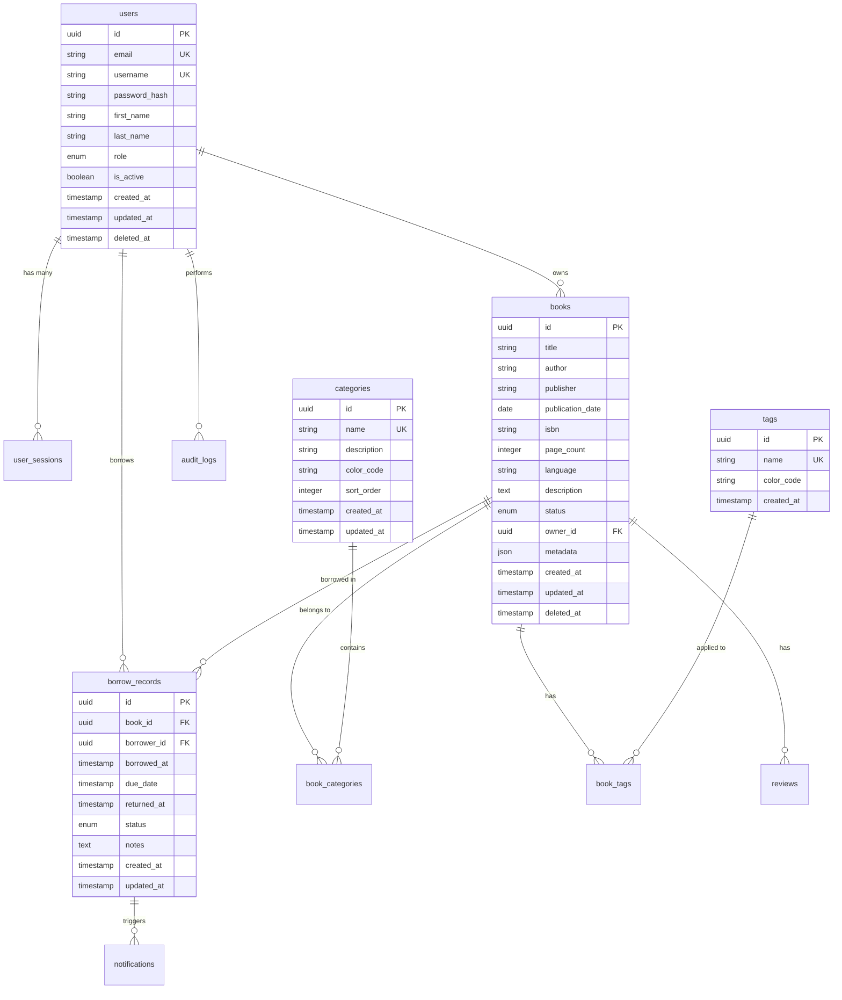

# 🗄️ データベース設計書 - 技術書管理システム

> PostgreSQL による高性能・高可用性データベース設計

## 📋 設計概要

### データベース基本方針
- **ACID準拠**: トランザクションの整合性確保
- **正規化**: 第3正規形までの正規化によるデータ整合性
- **パフォーマンス重視**: インデックス最適化とクエリ効率化
- **拡張性**: 将来的な機能追加への対応
- **データ整合性**: 制約とトリガーによる品質保証
- **バックアップ戦略**: Point-in-Time Recovery対応

### 技術仕様
| 項目 | 仕様 | 理由 |
|------|------|------|
| **データベース** | PostgreSQL 15+ | ACID準拠、JSON対応、拡張性 |
| **文字コード** | UTF-8 | 多言語対応、国際化 |
| **タイムゾーン** | Asia/Tokyo | 日本時間での統一管理 |
| **接続プール** | PgBouncer | 接続効率化、リソース最適化 |
| **レプリケーション** | Streaming Replication | 高可用性、読み取り負荷分散 |
| **バックアップ** | WAL-E / pg_dump | 継続的バックアップとポイントインタイム復旧 |

## 🏗️ データベース構造

### ER図


## 📊 テーブル詳細設計

### ユーザー管理

#### users テーブル
```sql
CREATE TABLE users (
    id UUID PRIMARY KEY DEFAULT gen_random_uuid(),
    email VARCHAR(254) UNIQUE NOT NULL,
    username VARCHAR(50) UNIQUE NOT NULL,
    password_hash VARCHAR(255) NOT NULL,
    first_name VARCHAR(50) NOT NULL,
    last_name VARCHAR(50) NOT NULL,
    role user_role NOT NULL DEFAULT 'user',
    is_active BOOLEAN NOT NULL DEFAULT true,
    email_verified BOOLEAN NOT NULL DEFAULT false,
    email_verified_at TIMESTAMP WITH TIME ZONE,
    phone_number VARCHAR(20),
    avatar_url TEXT,
    preferences JSONB DEFAULT '{}',
    created_at TIMESTAMP WITH TIME ZONE NOT NULL DEFAULT CURRENT_TIMESTAMP,
    updated_at TIMESTAMP WITH TIME ZONE NOT NULL DEFAULT CURRENT_TIMESTAMP,
    deleted_at TIMESTAMP WITH TIME ZONE,
    
    CONSTRAINT users_email_check CHECK (email ~* '^[A-Za-z0-9._%+-]+@[A-Za-z0-9.-]+\.[A-Za-z]{2,}$'),
    CONSTRAINT users_username_check CHECK (username ~* '^[a-zA-Z0-9_]{3,50}$'),
    CONSTRAINT users_phone_check CHECK (phone_number IS NULL OR phone_number ~* '^\+?[1-9]\d{1,14}$')
);

-- ユーザーロール enum
CREATE TYPE user_role AS ENUM ('admin', 'librarian', 'user');

-- インデックス
CREATE INDEX idx_users_email ON users(email);
CREATE INDEX idx_users_username ON users(username);
CREATE INDEX idx_users_role ON users(role);
CREATE INDEX idx_users_active ON users(is_active) WHERE is_active = true;
CREATE INDEX idx_users_created_at ON users(created_at);
CREATE INDEX idx_users_deleted_at ON users(deleted_at) WHERE deleted_at IS NOT NULL;

-- 全文検索インデックス
CREATE INDEX idx_users_search ON users USING gin(
    to_tsvector('japanese', coalesce(first_name, '') || ' ' || coalesce(last_name, '') || ' ' || coalesce(email, ''))
);

-- 更新日時自動更新トリガー
CREATE OR REPLACE FUNCTION update_updated_at_column()
RETURNS TRIGGER AS $$
BEGIN
    NEW.updated_at = CURRENT_TIMESTAMP;
    RETURN NEW;
END;
$$ language 'plpgsql';

CREATE TRIGGER update_users_updated_at 
    BEFORE UPDATE ON users 
    FOR EACH ROW 
    EXECUTE FUNCTION update_updated_at_column();
```

#### user_sessions テーブル
```sql
CREATE TABLE user_sessions (
    id UUID PRIMARY KEY DEFAULT gen_random_uuid(),
    user_id UUID NOT NULL REFERENCES users(id) ON DELETE CASCADE,
    session_token VARCHAR(255) UNIQUE NOT NULL,
    refresh_token VARCHAR(255) UNIQUE NOT NULL,
    device_info JSONB DEFAULT '{}',
    ip_address INET,
    user_agent TEXT,
    is_active BOOLEAN NOT NULL DEFAULT true,
    expires_at TIMESTAMP WITH TIME ZONE NOT NULL,
    last_activity_at TIMESTAMP WITH TIME ZONE NOT NULL DEFAULT CURRENT_TIMESTAMP,
    created_at TIMESTAMP WITH TIME ZONE NOT NULL DEFAULT CURRENT_TIMESTAMP,
    
    CONSTRAINT sessions_expires_future CHECK (expires_at > created_at)
);

-- インデックス
CREATE INDEX idx_sessions_user_id ON user_sessions(user_id);
CREATE INDEX idx_sessions_token ON user_sessions(session_token);
CREATE INDEX idx_sessions_refresh_token ON user_sessions(refresh_token);
CREATE INDEX idx_sessions_active ON user_sessions(is_active, expires_at) WHERE is_active = true;
CREATE INDEX idx_sessions_ip ON user_sessions(ip_address);
CREATE INDEX idx_sessions_last_activity ON user_sessions(last_activity_at);

-- 期限切れセッション自動削除
CREATE OR REPLACE FUNCTION cleanup_expired_sessions()
RETURNS void AS $$
BEGIN
    DELETE FROM user_sessions 
    WHERE expires_at < CURRENT_TIMESTAMP - INTERVAL '1 day';
END;
$$ LANGUAGE plpgsql;

-- 定期実行スケジュール（pg_cronが必要）
-- SELECT cron.schedule('cleanup-sessions', '0 2 * * *', 'SELECT cleanup_expired_sessions();');
```

### 書籍管理

#### books テーブル
```sql
CREATE TABLE books (
    id UUID PRIMARY KEY DEFAULT gen_random_uuid(),
    title VARCHAR(200) NOT NULL,
    author VARCHAR(100) NOT NULL,
    publisher VARCHAR(100) NOT NULL,
    publication_date DATE,
    isbn VARCHAR(17), -- ISBN-13: 978-XXXXXXXXX
    page_count INTEGER CHECK (page_count > 0),
    language VARCHAR(20) NOT NULL DEFAULT '日本語',
    description TEXT,
    status book_status NOT NULL DEFAULT 'available',
    condition book_condition NOT NULL DEFAULT 'good',
    location VARCHAR(100), -- 物理的な保管場所
    owner_id UUID NOT NULL REFERENCES users(id) ON DELETE RESTRICT,
    purchase_price DECIMAL(10,2),
    purchase_date DATE,
    metadata JSONB DEFAULT '{}', -- 拡張メタデータ
    search_vector tsvector, -- 全文検索用
    created_at TIMESTAMP WITH TIME ZONE NOT NULL DEFAULT CURRENT_TIMESTAMP,
    updated_at TIMESTAMP WITH TIME ZONE NOT NULL DEFAULT CURRENT_TIMESTAMP,
    deleted_at TIMESTAMP WITH TIME ZONE,
    
    CONSTRAINT books_isbn_check CHECK (isbn IS NULL OR isbn ~* '^(97[89])?[0-9]{9}[0-9X]$'),
    CONSTRAINT books_language_check CHECK (language IN ('日本語', '英語', 'その他')),
    CONSTRAINT books_price_check CHECK (purchase_price IS NULL OR purchase_price >= 0)
);

-- 書籍ステータス enum
CREATE TYPE book_status AS ENUM ('available', 'borrowed', 'maintenance', 'lost', 'reserved');
CREATE TYPE book_condition AS ENUM ('excellent', 'good', 'fair', 'poor', 'damaged');

-- インデックス
CREATE INDEX idx_books_title ON books(title);
CREATE INDEX idx_books_author ON books(author);
CREATE INDEX idx_books_publisher ON books(publisher);
CREATE INDEX idx_books_isbn ON books(isbn) WHERE isbn IS NOT NULL;
CREATE INDEX idx_books_status ON books(status);
CREATE INDEX idx_books_owner ON books(owner_id);
CREATE INDEX idx_books_language ON books(language);
CREATE INDEX idx_books_publication_date ON books(publication_date);
CREATE INDEX idx_books_created_at ON books(created_at);
CREATE INDEX idx_books_deleted_at ON books(deleted_at) WHERE deleted_at IS NOT NULL;

-- 複合インデックス
CREATE INDEX idx_books_status_owner ON books(status, owner_id);
CREATE INDEX idx_books_author_title ON books(author, title);

-- 全文検索インデックス
CREATE INDEX idx_books_search ON books USING gin(search_vector);

-- 全文検索ベクター更新トリガー
CREATE OR REPLACE FUNCTION update_book_search_vector()
RETURNS TRIGGER AS $$
BEGIN
    NEW.search_vector := to_tsvector('japanese', 
        coalesce(NEW.title, '') || ' ' || 
        coalesce(NEW.author, '') || ' ' || 
        coalesce(NEW.publisher, '') || ' ' || 
        coalesce(NEW.description, '')
    );
    RETURN NEW;
END;
$$ LANGUAGE plpgsql;

CREATE TRIGGER update_books_search_vector
    BEFORE INSERT OR UPDATE ON books
    FOR EACH ROW
    EXECUTE FUNCTION update_book_search_vector();

CREATE TRIGGER update_books_updated_at 
    BEFORE UPDATE ON books 
    FOR EACH ROW 
    EXECUTE FUNCTION update_updated_at_column();
```

#### categories テーブル
```sql
CREATE TABLE categories (
    id UUID PRIMARY KEY DEFAULT gen_random_uuid(),
    name VARCHAR(50) UNIQUE NOT NULL,
    description TEXT,
    color_code VARCHAR(7) DEFAULT '#6366f1', -- HEX color
    icon VARCHAR(50),
    parent_id UUID REFERENCES categories(id) ON DELETE SET NULL,
    sort_order INTEGER NOT NULL DEFAULT 0,
    is_active BOOLEAN NOT NULL DEFAULT true,
    created_at TIMESTAMP WITH TIME ZONE NOT NULL DEFAULT CURRENT_TIMESTAMP,
    updated_at TIMESTAMP WITH TIME ZONE NOT NULL DEFAULT CURRENT_TIMESTAMP,
    
    CONSTRAINT categories_color_check CHECK (color_code ~* '^#[0-9A-Fa-f]{6}$'),
    CONSTRAINT categories_no_self_parent CHECK (id != parent_id)
);

-- インデックス
CREATE INDEX idx_categories_name ON categories(name);
CREATE INDEX idx_categories_parent ON categories(parent_id);
CREATE INDEX idx_categories_sort ON categories(sort_order);
CREATE INDEX idx_categories_active ON categories(is_active) WHERE is_active = true;

-- 階層構造チェック（循環参照防止）
CREATE OR REPLACE FUNCTION check_category_hierarchy()
RETURNS TRIGGER AS $$
DECLARE
    current_id UUID := NEW.parent_id;
    depth INTEGER := 0;
BEGIN
    WHILE current_id IS NOT NULL AND depth < 10 LOOP
        IF current_id = NEW.id THEN
            RAISE EXCEPTION 'Circular reference detected in category hierarchy';
        END IF;
        
        SELECT parent_id INTO current_id FROM categories WHERE id = current_id;
        depth := depth + 1;
    END LOOP;
    
    IF depth >= 10 THEN
        RAISE EXCEPTION 'Category hierarchy too deep (max 10 levels)';
    END IF;
    
    RETURN NEW;
END;
$$ LANGUAGE plpgsql;

CREATE TRIGGER check_categories_hierarchy
    BEFORE INSERT OR UPDATE ON categories
    FOR EACH ROW
    EXECUTE FUNCTION check_category_hierarchy();

CREATE TRIGGER update_categories_updated_at 
    BEFORE UPDATE ON categories 
    FOR EACH ROW 
    EXECUTE FUNCTION update_updated_at_column();
```

#### book_categories テーブル（多対多関係）
```sql
CREATE TABLE book_categories (
    book_id UUID NOT NULL REFERENCES books(id) ON DELETE CASCADE,
    category_id UUID NOT NULL REFERENCES categories(id) ON DELETE CASCADE,
    created_at TIMESTAMP WITH TIME ZONE NOT NULL DEFAULT CURRENT_TIMESTAMP,
    
    PRIMARY KEY (book_id, category_id)
);

-- インデックス
CREATE INDEX idx_book_categories_book ON book_categories(book_id);
CREATE INDEX idx_book_categories_category ON book_categories(category_id);
```

#### tags テーブル
```sql
CREATE TABLE tags (
    id UUID PRIMARY KEY DEFAULT gen_random_uuid(),
    name VARCHAR(50) UNIQUE NOT NULL,
    color_code VARCHAR(7) DEFAULT '#10b981',
    usage_count INTEGER NOT NULL DEFAULT 0,
    created_at TIMESTAMP WITH TIME ZONE NOT NULL DEFAULT CURRENT_TIMESTAMP,
    
    CONSTRAINT tags_color_check CHECK (color_code ~* '^#[0-9A-Fa-f]{6}$'),
    CONSTRAINT tags_usage_check CHECK (usage_count >= 0)
);

-- インデックス
CREATE INDEX idx_tags_name ON tags(name);
CREATE INDEX idx_tags_usage ON tags(usage_count DESC);
```

#### book_tags テーブル（多対多関係）
```sql
CREATE TABLE book_tags (
    book_id UUID NOT NULL REFERENCES books(id) ON DELETE CASCADE,
    tag_id UUID NOT NULL REFERENCES tags(id) ON DELETE CASCADE,
    created_at TIMESTAMP WITH TIME ZONE NOT NULL DEFAULT CURRENT_TIMESTAMP,
    
    PRIMARY KEY (book_id, tag_id)
);

-- インデックス
CREATE INDEX idx_book_tags_book ON book_tags(book_id);
CREATE INDEX idx_book_tags_tag ON book_tags(tag_id);

-- タグ使用カウント更新トリガー
CREATE OR REPLACE FUNCTION update_tag_usage_count()
RETURNS TRIGGER AS $$
BEGIN
    IF TG_OP = 'INSERT' THEN
        UPDATE tags SET usage_count = usage_count + 1 WHERE id = NEW.tag_id;
        RETURN NEW;
    ELSIF TG_OP = 'DELETE' THEN
        UPDATE tags SET usage_count = usage_count - 1 WHERE id = OLD.tag_id;
        RETURN OLD;
    END IF;
    RETURN NULL;
END;
$$ LANGUAGE plpgsql;

CREATE TRIGGER update_tag_usage_count_trigger
    AFTER INSERT OR DELETE ON book_tags
    FOR EACH ROW
    EXECUTE FUNCTION update_tag_usage_count();
```

### 貸出管理

#### borrow_records テーブル
```sql
CREATE TABLE borrow_records (
    id UUID PRIMARY KEY DEFAULT gen_random_uuid(),
    book_id UUID NOT NULL REFERENCES books(id) ON DELETE RESTRICT,
    borrower_id UUID NOT NULL REFERENCES users(id) ON DELETE RESTRICT,
    approved_by UUID REFERENCES users(id) ON DELETE SET NULL,
    borrowed_at TIMESTAMP WITH TIME ZONE NOT NULL DEFAULT CURRENT_TIMESTAMP,
    due_date TIMESTAMP WITH TIME ZONE NOT NULL,
    returned_at TIMESTAMP WITH TIME ZONE,
    status borrow_status NOT NULL DEFAULT 'active',
    renewal_count INTEGER NOT NULL DEFAULT 0,
    notes TEXT,
    condition_on_borrow book_condition NOT NULL,
    condition_on_return book_condition,
    late_fee DECIMAL(10,2) DEFAULT 0,
    created_at TIMESTAMP WITH TIME ZONE NOT NULL DEFAULT CURRENT_TIMESTAMP,
    updated_at TIMESTAMP WITH TIME ZONE NOT NULL DEFAULT CURRENT_TIMESTAMP,
    
    CONSTRAINT borrow_due_after_borrowed CHECK (due_date > borrowed_at),
    CONSTRAINT borrow_returned_after_borrowed CHECK (returned_at IS NULL OR returned_at >= borrowed_at),
    CONSTRAINT borrow_renewal_count_check CHECK (renewal_count >= 0 AND renewal_count <= 3),
    CONSTRAINT borrow_late_fee_check CHECK (late_fee >= 0)
);

-- 貸出ステータス enum
CREATE TYPE borrow_status AS ENUM ('pending', 'active', 'overdue', 'returned', 'lost', 'cancelled');

-- インデックス
CREATE INDEX idx_borrow_records_book ON borrow_records(book_id);
CREATE INDEX idx_borrow_records_borrower ON borrow_records(borrower_id);
CREATE INDEX idx_borrow_records_status ON borrow_records(status);
CREATE INDEX idx_borrow_records_due_date ON borrow_records(due_date);
CREATE INDEX idx_borrow_records_borrowed_at ON borrow_records(borrowed_at);
CREATE INDEX idx_borrow_records_returned_at ON borrow_records(returned_at);

-- 複合インデックス
CREATE INDEX idx_borrow_records_active ON borrow_records(borrower_id, status) WHERE status IN ('active', 'overdue');
CREATE INDEX idx_borrow_records_overdue ON borrow_records(due_date, status) WHERE status = 'active';

-- 貸出時の書籍ステータス更新トリガー
CREATE OR REPLACE FUNCTION update_book_status_on_borrow()
RETURNS TRIGGER AS $$
BEGIN
    IF TG_OP = 'INSERT' AND NEW.status = 'active' THEN
        UPDATE books SET status = 'borrowed' WHERE id = NEW.book_id;
    ELSIF TG_OP = 'UPDATE' AND NEW.status = 'returned' AND OLD.status != 'returned' THEN
        UPDATE books SET status = 'available' WHERE id = NEW.book_id;
    END IF;
    RETURN COALESCE(NEW, OLD);
END;
$$ LANGUAGE plpgsql;

CREATE TRIGGER update_book_status_borrow_trigger
    AFTER INSERT OR UPDATE ON borrow_records
    FOR EACH ROW
    EXECUTE FUNCTION update_book_status_on_borrow();

CREATE TRIGGER update_borrow_records_updated_at 
    BEFORE UPDATE ON borrow_records 
    FOR EACH ROW 
    EXECUTE FUNCTION update_updated_at_column();
```

#### reservations テーブル
```sql
CREATE TABLE reservations (
    id UUID PRIMARY KEY DEFAULT gen_random_uuid(),
    book_id UUID NOT NULL REFERENCES books(id) ON DELETE CASCADE,
    user_id UUID NOT NULL REFERENCES users(id) ON DELETE CASCADE,
    status reservation_status NOT NULL DEFAULT 'active',
    priority INTEGER NOT NULL DEFAULT 1,
    expires_at TIMESTAMP WITH TIME ZONE NOT NULL,
    notified_at TIMESTAMP WITH TIME ZONE,
    notes TEXT,
    created_at TIMESTAMP WITH TIME ZONE NOT NULL DEFAULT CURRENT_TIMESTAMP,
    updated_at TIMESTAMP WITH TIME ZONE NOT NULL DEFAULT CURRENT_TIMESTAMP,
    
    CONSTRAINT reservations_expires_future CHECK (expires_at > created_at),
    CONSTRAINT reservations_priority_check CHECK (priority > 0),
    UNIQUE (book_id, user_id, status) DEFERRABLE INITIALLY DEFERRED
);

-- 予約ステータス enum
CREATE TYPE reservation_status AS ENUM ('active', 'fulfilled', 'expired', 'cancelled');

-- インデックス
CREATE INDEX idx_reservations_book ON reservations(book_id);
CREATE INDEX idx_reservations_user ON reservations(user_id);
CREATE INDEX idx_reservations_status ON reservations(status);
CREATE INDEX idx_reservations_expires ON reservations(expires_at);
CREATE INDEX idx_reservations_priority ON reservations(book_id, priority, created_at) WHERE status = 'active';

CREATE TRIGGER update_reservations_updated_at 
    BEFORE UPDATE ON reservations 
    FOR EACH ROW 
    EXECUTE FUNCTION update_updated_at_column();
```

### レビュー・評価

#### reviews テーブル
```sql
CREATE TABLE reviews (
    id UUID PRIMARY KEY DEFAULT gen_random_uuid(),
    book_id UUID NOT NULL REFERENCES books(id) ON DELETE CASCADE,
    user_id UUID NOT NULL REFERENCES users(id) ON DELETE CASCADE,
    rating INTEGER NOT NULL CHECK (rating >= 1 AND rating <= 5),
    title VARCHAR(100),
    content TEXT,
    is_spoiler BOOLEAN NOT NULL DEFAULT false,
    helpful_count INTEGER NOT NULL DEFAULT 0,
    reported_count INTEGER NOT NULL DEFAULT 0,
    status review_status NOT NULL DEFAULT 'published',
    created_at TIMESTAMP WITH TIME ZONE NOT NULL DEFAULT CURRENT_TIMESTAMP,
    updated_at TIMESTAMP WITH TIME ZONE NOT NULL DEFAULT CURRENT_TIMESTAMP,
    
    CONSTRAINT reviews_helpful_count_check CHECK (helpful_count >= 0),
    CONSTRAINT reviews_reported_count_check CHECK (reported_count >= 0),
    UNIQUE (book_id, user_id)
);

-- レビューステータス enum
CREATE TYPE review_status AS ENUM ('draft', 'published', 'hidden', 'deleted');

-- インデックス
CREATE INDEX idx_reviews_book ON reviews(book_id);
CREATE INDEX idx_reviews_user ON reviews(user_id);
CREATE INDEX idx_reviews_rating ON reviews(rating);
CREATE INDEX idx_reviews_status ON reviews(status);
CREATE INDEX idx_reviews_helpful ON reviews(helpful_count DESC);
CREATE INDEX idx_reviews_created_at ON reviews(created_at DESC);

-- 全文検索インデックス
CREATE INDEX idx_reviews_search ON reviews USING gin(
    to_tsvector('japanese', coalesce(title, '') || ' ' || coalesce(content, ''))
) WHERE status = 'published';

CREATE TRIGGER update_reviews_updated_at 
    BEFORE UPDATE ON reviews 
    FOR EACH ROW 
    EXECUTE FUNCTION update_updated_at_column();
```

### 通知システム

#### notifications テーブル
```sql
CREATE TABLE notifications (
    id UUID PRIMARY KEY DEFAULT gen_random_uuid(),
    user_id UUID NOT NULL REFERENCES users(id) ON DELETE CASCADE,
    type notification_type NOT NULL,
    title VARCHAR(200) NOT NULL,
    message TEXT NOT NULL,
    data JSONB DEFAULT '{}',
    is_read BOOLEAN NOT NULL DEFAULT false,
    read_at TIMESTAMP WITH TIME ZONE,
    priority notification_priority NOT NULL DEFAULT 'normal',
    expires_at TIMESTAMP WITH TIME ZONE,
    created_at TIMESTAMP WITH TIME ZONE NOT NULL DEFAULT CURRENT_TIMESTAMP,
    
    CONSTRAINT notifications_read_at_check CHECK (
        (is_read = false AND read_at IS NULL) OR 
        (is_read = true AND read_at IS NOT NULL)
    )
);

-- 通知タイプ enum
CREATE TYPE notification_type AS ENUM (
    'book_due_reminder',
    'book_overdue',
    'book_available',
    'reservation_fulfilled',
    'book_returned',
    'system_announcement',
    'account_update'
);

-- 通知優先度 enum  
CREATE TYPE notification_priority AS ENUM ('low', 'normal', 'high', 'urgent');

-- インデックス
CREATE INDEX idx_notifications_user ON notifications(user_id);
CREATE INDEX idx_notifications_type ON notifications(type);
CREATE INDEX idx_notifications_read ON notifications(is_read, created_at);
CREATE INDEX idx_notifications_priority ON notifications(priority, created_at);
CREATE INDEX idx_notifications_expires ON notifications(expires_at) WHERE expires_at IS NOT NULL;

-- 期限切れ通知自動削除
CREATE OR REPLACE FUNCTION cleanup_expired_notifications()
RETURNS void AS $$
BEGIN
    DELETE FROM notifications 
    WHERE expires_at < CURRENT_TIMESTAMP;
END;
$$ LANGUAGE plpgsql;
```

### 監査・ログ

#### audit_logs テーブル
```sql
CREATE TABLE audit_logs (
    id UUID PRIMARY KEY DEFAULT gen_random_uuid(),
    user_id UUID REFERENCES users(id) ON DELETE SET NULL,
    session_id UUID,
    action VARCHAR(100) NOT NULL,
    resource_type VARCHAR(50) NOT NULL,
    resource_id UUID,
    old_values JSONB,
    new_values JSONB,
    ip_address INET,
    user_agent TEXT,
    success BOOLEAN NOT NULL,
    error_message TEXT,
    metadata JSONB DEFAULT '{}',
    created_at TIMESTAMP WITH TIME ZONE NOT NULL DEFAULT CURRENT_TIMESTAMP,
    
    CONSTRAINT audit_logs_error_check CHECK (
        (success = true AND error_message IS NULL) OR 
        (success = false AND error_message IS NOT NULL)
    )
);

-- インデックス
CREATE INDEX idx_audit_logs_user ON audit_logs(user_id);
CREATE INDEX idx_audit_logs_action ON audit_logs(action);
CREATE INDEX idx_audit_logs_resource ON audit_logs(resource_type, resource_id);
CREATE INDEX idx_audit_logs_created_at ON audit_logs(created_at);
CREATE INDEX idx_audit_logs_success ON audit_logs(success);
CREATE INDEX idx_audit_logs_ip ON audit_logs(ip_address);

-- パーティショニング（月次）
CREATE TABLE audit_logs_y2025m01 PARTITION OF audit_logs
    FOR VALUES FROM ('2025-01-01') TO ('2025-02-01');

-- 自動パーティション作成関数
CREATE OR REPLACE FUNCTION create_monthly_audit_partition(target_date DATE)
RETURNS void AS $$
DECLARE
    partition_name TEXT;
    start_date DATE;
    end_date DATE;
BEGIN
    start_date := date_trunc('month', target_date);
    end_date := start_date + INTERVAL '1 month';
    partition_name := 'audit_logs_y' || to_char(start_date, 'YYYY') || 'm' || to_char(start_date, 'MM');
    
    EXECUTE format('CREATE TABLE IF NOT EXISTS %I PARTITION OF audit_logs FOR VALUES FROM (%L) TO (%L)',
                   partition_name, start_date, end_date);
END;
$$ LANGUAGE plpgsql;
```

## 🔧 データベース機能実装

### ストアドプロシージャ・関数

#### 書籍検索関数
```sql
-- 高度な書籍検索
CREATE OR REPLACE FUNCTION search_books(
    p_query TEXT DEFAULT NULL,
    p_category_id UUID DEFAULT NULL,
    p_tags TEXT[] DEFAULT NULL,
    p_status book_status DEFAULT NULL,
    p_language VARCHAR DEFAULT NULL,
    p_available_only BOOLEAN DEFAULT FALSE,
    p_sort_by VARCHAR DEFAULT 'relevance',
    p_sort_order VARCHAR DEFAULT 'DESC',
    p_limit INTEGER DEFAULT 20,
    p_offset INTEGER DEFAULT 0
)
RETURNS TABLE(
    id UUID,
    title VARCHAR,
    author VARCHAR,
    publisher VARCHAR,
    publication_date DATE,
    status book_status,
    language VARCHAR,
    description TEXT,
    owner_id UUID,
    rank REAL
) AS $$
DECLARE
    sort_clause TEXT;
    where_clause TEXT := 'WHERE b.deleted_at IS NULL';
BEGIN
    -- 検索条件構築
    IF p_query IS NOT NULL THEN
        where_clause := where_clause || ' AND b.search_vector @@ plainto_tsquery(''japanese'', ' || quote_literal(p_query) || ')';
    END IF;
    
    IF p_category_id IS NOT NULL THEN
        where_clause := where_clause || ' AND EXISTS (SELECT 1 FROM book_categories bc WHERE bc.book_id = b.id AND bc.category_id = ' || quote_literal(p_category_id) || ')';
    END IF;
    
    IF p_tags IS NOT NULL THEN
        where_clause := where_clause || ' AND EXISTS (SELECT 1 FROM book_tags bt JOIN tags t ON bt.tag_id = t.id WHERE bt.book_id = b.id AND t.name = ANY(' || quote_literal(p_tags) || '))';
    END IF;
    
    IF p_status IS NOT NULL THEN
        where_clause := where_clause || ' AND b.status = ' || quote_literal(p_status);
    END IF;
    
    IF p_language IS NOT NULL THEN
        where_clause := where_clause || ' AND b.language = ' || quote_literal(p_language);
    END IF;
    
    IF p_available_only THEN
        where_clause := where_clause || ' AND b.status = ''available''';
    END IF;
    
    -- ソート条件構築
    CASE p_sort_by
        WHEN 'relevance' THEN
            IF p_query IS NOT NULL THEN
                sort_clause := 'ORDER BY ts_rank(b.search_vector, plainto_tsquery(''japanese'', ' || quote_literal(p_query) || ')) ' || p_sort_order;
            ELSE
                sort_clause := 'ORDER BY b.created_at ' || p_sort_order;
            END IF;
        WHEN 'title' THEN
            sort_clause := 'ORDER BY b.title ' || p_sort_order;
        WHEN 'author' THEN
            sort_clause := 'ORDER BY b.author ' || p_sort_order;
        WHEN 'publication_date' THEN
            sort_clause := 'ORDER BY b.publication_date ' || p_sort_order || ' NULLS LAST';
        WHEN 'created_at' THEN
            sort_clause := 'ORDER BY b.created_at ' || p_sort_order;
        ELSE
            sort_clause := 'ORDER BY b.created_at DESC';
    END CASE;
    
    -- クエリ実行
    RETURN QUERY EXECUTE format('
        SELECT b.id, b.title, b.author, b.publisher, b.publication_date, 
               b.status, b.language, b.description, b.owner_id,
               COALESCE(ts_rank(b.search_vector, plainto_tsquery(''japanese'', %L)), 0) as rank
        FROM books b
        %s
        %s
        LIMIT %s OFFSET %s',
        COALESCE(p_query, ''), where_clause, sort_clause, p_limit, p_offset
    );
END;
$$ LANGUAGE plpgsql;
```

#### 貸出管理関数
```sql
-- 書籍借出処理
CREATE OR REPLACE FUNCTION borrow_book(
    p_book_id UUID,
    p_borrower_id UUID,
    p_due_date TIMESTAMP WITH TIME ZONE DEFAULT NULL,
    p_approved_by UUID DEFAULT NULL
)
RETURNS UUID AS $$
DECLARE
    v_record_id UUID;
    v_book_status book_status;
    v_book_condition book_condition;
    v_default_due_date TIMESTAMP WITH TIME ZONE;
BEGIN
    -- 書籍の状態確認
    SELECT status, condition INTO v_book_status, v_book_condition
    FROM books 
    WHERE id = p_book_id AND deleted_at IS NULL;
    
    IF NOT FOUND THEN
        RAISE EXCEPTION 'Book not found';
    END IF;
    
    IF v_book_status != 'available' THEN
        RAISE EXCEPTION 'Book is not available for borrowing. Current status: %', v_book_status;
    END IF;
    
    -- デフォルト返却日設定（2週間後）
    v_default_due_date := COALESCE(p_due_date, CURRENT_TIMESTAMP + INTERVAL '14 days');
    
    -- 貸出記録作成
    INSERT INTO borrow_records (
        book_id, borrower_id, approved_by, due_date, 
        condition_on_borrow, status
    ) VALUES (
        p_book_id, p_borrower_id, p_approved_by, v_default_due_date,
        v_book_condition, 'active'
    ) RETURNING id INTO v_record_id;
    
    -- 書籍ステータス更新
    UPDATE books SET status = 'borrowed' WHERE id = p_book_id;
    
    -- 予約があれば次の予約者に通知
    UPDATE reservations 
    SET status = 'fulfilled' 
    WHERE book_id = p_book_id 
      AND status = 'active' 
      AND user_id = p_borrower_id;
    
    RETURN v_record_id;
END;
$$ LANGUAGE plpgsql;

-- 書籍返却処理
CREATE OR REPLACE FUNCTION return_book(
    p_record_id UUID,
    p_condition book_condition DEFAULT 'good',
    p_notes TEXT DEFAULT NULL
)
RETURNS BOOLEAN AS $$
DECLARE
    v_book_id UUID;
    v_late_fee DECIMAL(10,2) := 0;
    v_due_date TIMESTAMP WITH TIME ZONE;
BEGIN
    -- 貸出記録確認
    SELECT book_id, due_date INTO v_book_id, v_due_date
    FROM borrow_records 
    WHERE id = p_record_id AND status = 'active';
    
    IF NOT FOUND THEN
        RAISE EXCEPTION 'Active borrow record not found';
    END IF;
    
    -- 延滞料金計算
    IF CURRENT_TIMESTAMP > v_due_date THEN
        v_late_fee := GREATEST(0, EXTRACT(DAYS FROM CURRENT_TIMESTAMP - v_due_date) * 100); -- 1日100円
    END IF;
    
    -- 貸出記録更新
    UPDATE borrow_records 
    SET status = 'returned',
        returned_at = CURRENT_TIMESTAMP,
        condition_on_return = p_condition,
        late_fee = v_late_fee,
        notes = p_notes
    WHERE id = p_record_id;
    
    -- 書籍ステータス更新
    UPDATE books SET status = 'available' WHERE id = v_book_id;
    
    -- 予約者がいれば通知
    INSERT INTO notifications (user_id, type, title, message, data)
    SELECT r.user_id, 'book_available', 
           '予約していた書籍が利用可能になりました',
           b.title || ' が返却されました。',
           jsonb_build_object('book_id', v_book_id, 'reservation_id', r.id)
    FROM reservations r
    JOIN books b ON b.id = r.book_id
    WHERE r.book_id = v_book_id 
      AND r.status = 'active'
    ORDER BY r.priority, r.created_at
    LIMIT 1;
    
    RETURN TRUE;
END;
$$ LANGUAGE plpgsql;
```

### ビュー

#### 書籍統計ビュー
```sql
-- 書籍統計ビュー
CREATE VIEW book_statistics AS
SELECT 
    -- 全体統計
    COUNT(*) as total_books,
    COUNT(*) FILTER (WHERE status = 'available') as available_books,
    COUNT(*) FILTER (WHERE status = 'borrowed') as borrowed_books,
    COUNT(*) FILTER (WHERE status = 'maintenance') as maintenance_books,
    
    -- 言語別統計
    COUNT(*) FILTER (WHERE language = '日本語') as japanese_books,
    COUNT(*) FILTER (WHERE language = '英語') as english_books,
    COUNT(*) FILTER (WHERE language = 'その他') as other_language_books,
    
    -- 期間別統計
    COUNT(*) FILTER (WHERE created_at >= CURRENT_DATE - INTERVAL '30 days') as books_added_last_30_days,
    COUNT(*) FILTER (WHERE created_at >= CURRENT_DATE - INTERVAL '7 days') as books_added_last_7_days,
    
    -- 平均・その他
    AVG(page_count) FILTER (WHERE page_count IS NOT NULL) as avg_page_count,
    MIN(publication_date) as oldest_publication_date,
    MAX(publication_date) as newest_publication_date
FROM books 
WHERE deleted_at IS NULL;

-- ユーザー別貸出統計ビュー
CREATE VIEW user_borrow_statistics AS
SELECT 
    u.id as user_id,
    u.first_name || ' ' || u.last_name as user_name,
    COUNT(br.id) as total_borrows,
    COUNT(br.id) FILTER (WHERE br.status = 'active') as active_borrows,
    COUNT(br.id) FILTER (WHERE br.status = 'overdue') as overdue_borrows,
    COUNT(br.id) FILTER (WHERE br.status = 'returned') as returned_borrows,
    AVG(EXTRACT(DAYS FROM COALESCE(br.returned_at, CURRENT_TIMESTAMP) - br.borrowed_at)) as avg_borrow_days,
    SUM(br.late_fee) as total_late_fees,
    MAX(br.borrowed_at) as last_borrow_date
FROM users u
LEFT JOIN borrow_records br ON u.id = br.borrower_id
WHERE u.deleted_at IS NULL
GROUP BY u.id, u.first_name, u.last_name;

-- 人気書籍ビュー
CREATE VIEW popular_books AS
SELECT 
    b.id,
    b.title,
    b.author,
    b.publisher,
    COUNT(br.id) as borrow_count,
    AVG(r.rating) as avg_rating,
    COUNT(r.id) as review_count,
    COUNT(res.id) as reservation_count,
    COALESCE(AVG(r.rating), 0) * 0.4 + 
    COALESCE(COUNT(br.id), 0) * 0.3 + 
    COALESCE(COUNT(res.id), 0) * 0.3 as popularity_score
FROM books b
LEFT JOIN borrow_records br ON b.id = br.book_id
LEFT JOIN reviews r ON b.id = r.book_id AND r.status = 'published'
LEFT JOIN reservations res ON b.id = res.book_id
WHERE b.deleted_at IS NULL
GROUP BY b.id, b.title, b.author, b.publisher
ORDER BY popularity_score DESC;
```

## 📊 パフォーマンス最適化

### インデックス戦略

#### 複合インデックス
```sql
-- 検索性能向上のための複合インデックス
CREATE INDEX idx_books_search_filters ON books(status, language, deleted_at)
WHERE deleted_at IS NULL;

CREATE INDEX idx_borrow_records_user_status_date ON borrow_records(borrower_id, status, borrowed_at)
WHERE status IN ('active', 'overdue');

CREATE INDEX idx_notifications_user_unread ON notifications(user_id, created_at)
WHERE is_read = false;

-- 部分インデックス（条件付きインデックス）
CREATE INDEX idx_books_available ON books(created_at)
WHERE status = 'available' AND deleted_at IS NULL;

CREATE INDEX idx_overdue_borrows ON borrow_records(due_date, borrower_id)
WHERE status = 'active' AND due_date < CURRENT_TIMESTAMP;
```

#### パーティション設定
```sql
-- 監査ログテーブルの月次パーティショニング
ALTER TABLE audit_logs DETACH PARTITION audit_logs_default;

-- 自動パーティション管理
CREATE OR REPLACE FUNCTION maintain_audit_partitions()
RETURNS void AS $$
DECLARE
    current_month DATE;
    next_month DATE;
BEGIN
    current_month := date_trunc('month', CURRENT_DATE);
    next_month := current_month + INTERVAL '1 month';
    
    -- 来月のパーティション作成
    PERFORM create_monthly_audit_partition(next_month);
    
    -- 古いパーティション削除（1年以上前）
    FOR partition_name IN 
        SELECT schemaname||'.'||tablename 
        FROM pg_tables 
        WHERE tablename LIKE 'audit_logs_y%'
          AND tablename < 'audit_logs_y' || to_char(CURRENT_DATE - INTERVAL '1 year', 'YYYY') || 'm' || to_char(CURRENT_DATE - INTERVAL '1 year', 'MM')
    LOOP
        EXECUTE 'DROP TABLE IF EXISTS ' || partition_name;
    END LOOP;
END;
$$ LANGUAGE plpgsql;
```

### クエリ最適化

#### 統計情報更新
```sql
-- 統計情報の定期更新
CREATE OR REPLACE FUNCTION update_table_statistics()
RETURNS void AS $$
BEGIN
    ANALYZE books;
    ANALYZE users;
    ANALYZE borrow_records;
    ANALYZE reviews;
    ANALYZE notifications;
END;
$$ LANGUAGE plpgsql;

-- 自動VACUUM設定
ALTER TABLE books SET (
    autovacuum_vacuum_scale_factor = 0.1,
    autovacuum_analyze_scale_factor = 0.05
);

ALTER TABLE borrow_records SET (
    autovacuum_vacuum_scale_factor = 0.05,
    autovacuum_analyze_scale_factor = 0.02
);
```

## 🔄 バックアップ・復旧

### バックアップ戦略
```sql
-- Point-in-Time Recovery設定
-- postgresql.conf設定
-- wal_level = replica
-- archive_mode = on
-- archive_command = 'test ! -f /backup/archive/%f && cp %p /backup/archive/%f'
-- max_wal_senders = 3
-- wal_keep_segments = 32

-- 論理バックアップスクリプト
CREATE OR REPLACE FUNCTION create_logical_backup()
RETURNS TEXT AS $$
DECLARE
    backup_file TEXT;
    result TEXT;
BEGIN
    backup_file := '/backup/logical/techlib_' || to_char(CURRENT_TIMESTAMP, 'YYYY-MM-DD_HH24-MI-SS') || '.sql';
    
    -- pg_dumpコマンド実行（外部プロセス）
    SELECT into result pg_dump_command(backup_file);
    
    RETURN backup_file;
END;
$$ LANGUAGE plpgsql;

-- データ整合性チェック
CREATE OR REPLACE FUNCTION check_data_integrity()
RETURNS TABLE(table_name TEXT, check_result TEXT, details TEXT) AS $$
BEGIN
    -- 外部キー制約チェック
    RETURN QUERY
    SELECT 'foreign_keys'::TEXT, 
           CASE WHEN COUNT(*) = 0 THEN 'PASS' ELSE 'FAIL' END,
           'Foreign key violations: ' || COUNT(*)::TEXT
    FROM (
        SELECT 1 FROM borrow_records br LEFT JOIN books b ON br.book_id = b.id WHERE b.id IS NULL
        UNION ALL
        SELECT 1 FROM borrow_records br LEFT JOIN users u ON br.borrower_id = u.id WHERE u.id IS NULL
        UNION ALL
        SELECT 1 FROM book_categories bc LEFT JOIN books b ON bc.book_id = b.id WHERE b.id IS NULL
        UNION ALL
        SELECT 1 FROM book_categories bc LEFT JOIN categories c ON bc.category_id = c.id WHERE c.id IS NULL
    ) violations;
    
    -- データ矛盾チェック
    RETURN QUERY
    SELECT 'book_status_consistency'::TEXT,
           CASE WHEN COUNT(*) = 0 THEN 'PASS' ELSE 'FAIL' END,
           'Inconsistent book status: ' || COUNT(*)::TEXT
    FROM books b
    WHERE b.status = 'borrowed' 
      AND NOT EXISTS (
          SELECT 1 FROM borrow_records br 
          WHERE br.book_id = b.id AND br.status = 'active'
      );
      
    -- 孤立データチェック
    RETURN QUERY
    SELECT 'orphaned_data'::TEXT,
           CASE WHEN COUNT(*) = 0 THEN 'PASS' ELSE 'FAIL' END,
           'Orphaned records: ' || COUNT(*)::TEXT
    FROM (
        SELECT 1 FROM book_categories bc 
        LEFT JOIN books b ON bc.book_id = b.id 
        WHERE b.id IS NULL OR b.deleted_at IS NOT NULL
    ) orphaned;
END;
$$ LANGUAGE plpgsql;
```

## 🔧 初期データ・マイグレーション

### マスターデータ投入
```sql
-- カテゴリマスターデータ
INSERT INTO categories (name, description, color_code, sort_order) VALUES
('プログラミング', 'プログラミング言語・開発技術', '#3b82f6', 1),
('データベース', 'データベース設計・管理', '#10b981', 2),
('ネットワーク', 'ネットワーク構築・セキュリティ', '#f59e0b', 3),
('セキュリティ', 'サイバーセキュリティ・情報セキュリティ', '#ef4444', 4),
('クラウド', 'クラウドサービス・DevOps', '#8b5cf6', 5),
('AI・機械学習', '人工知能・機械学習・データサイエンス', '#06b6d4', 6),
('ビジネス', 'ビジネススキル・マネジメント', '#84cc16', 7),
('その他', 'その他の技術書', '#6b7280', 8);

-- タグマスターデータ
INSERT INTO tags (name, color_code) VALUES
('初心者向け', '#22c55e'),
('中級者向け', '#3b82f6'),
('上級者向け', '#ef4444'),
('実践的', '#f59e0b'),
('理論', '#8b5cf6'),
('入門書', '#06b6d4'),
('リファレンス', '#84cc16'),
('チュートリアル', '#ec4899');

-- システム管理者ユーザー
INSERT INTO users (email, username, password_hash, first_name, last_name, role) VALUES
('admin@techlib.local', 'admin', '$2a$12$encrypted_password_hash', 'システム', '管理者', 'admin');
```

### マイグレーションスクリプト
```sql
-- バージョン管理テーブル
CREATE TABLE IF NOT EXISTS schema_migrations (
    version VARCHAR(50) PRIMARY KEY,
    applied_at TIMESTAMP WITH TIME ZONE NOT NULL DEFAULT CURRENT_TIMESTAMP,
    description TEXT
);

-- マイグレーション例：v1.1.0 → v1.2.0
INSERT INTO schema_migrations (version, description) VALUES
('v1.2.0', 'Add book ISBN and metadata fields');

-- 新機能用テーブル追加
ALTER TABLE books 
ADD COLUMN IF NOT EXISTS isbn VARCHAR(17),
ADD COLUMN IF NOT EXISTS metadata JSONB DEFAULT '{}';

-- インデックス追加
CREATE INDEX IF NOT EXISTS idx_books_isbn ON books(isbn) WHERE isbn IS NOT NULL;

-- 完了ログ
INSERT INTO audit_logs (action, resource_type, success, metadata) VALUES
('schema_migration', 'database', true, 
 jsonb_build_object('version', 'v1.2.0', 'timestamp', CURRENT_TIMESTAMP));
```

---

**最終更新**: 2025年6月15日  
**対象バージョン**: PostgreSQL 15+  
**ステータス**: 設計完了